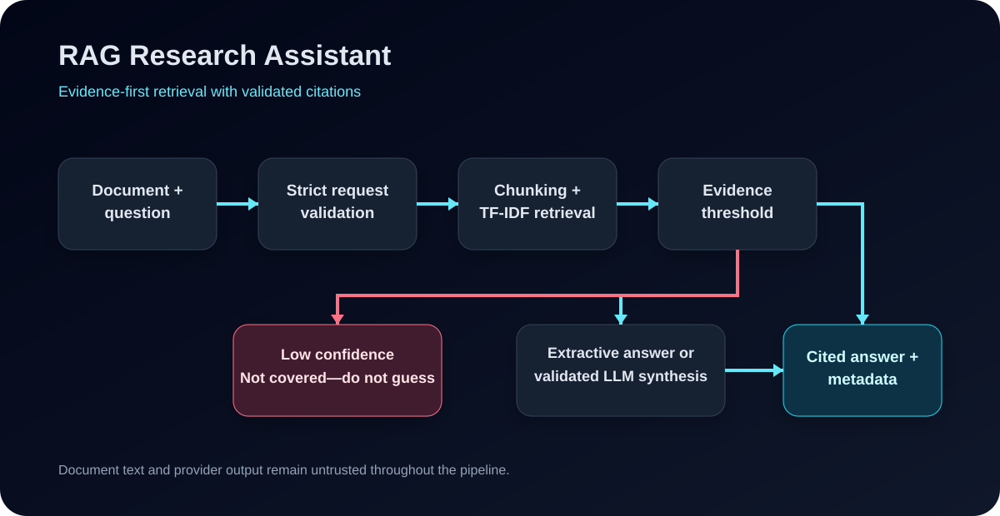

# RAG Research Assistant

A safety-first retrieval-augmented generation application that answers questions from supplied document evidence, cites retrieved source chunks and explicitly declines to guess when evidence is insufficient.



## Why this project exists

Many document-chat demos optimise for fluent answers without making retrieval quality, citation validity or failure behaviour visible. This project treats those concerns as core engineering requirements.

The default mode works without an API key: it chunks pasted text, builds a local TF-IDF index, ranks chunks with cosine similarity, applies retrieval/evidence answerability checks and returns grounded extractive evidence or a refusal. Optional OpenAI or Anthropic synthesis is available, but provider output remains untrusted and must pass strict JSON and retrieved-citation validation before it can reach the user.

**Architecture:** document → chunking → TF-IDF retrieval → evidence/answerability gate → extractive or constrained synthesis → citation validation → cited answer or refusal.

## Current verification — 5 September 2026

JR03 added permanent automated regressions for the seven Northstar outcomes documented in the 2 August live findings plus three unrelated Harborview cases. The reconstructed regression set now verifies direct grounded `No` answers for explicit denials, safe description of quoted prompt-injection text, continued refusal of the unsupported CEO question, and concise direct numeric answers.

The existing deterministic evaluation remains a separate 57-case golden set across three synthetic documents. Current metrics meet the unchanged committed thresholds:

| Metric | Current result |
|---|---:|
| Hit@1 | 94.6% |
| Hit@3 | 100.0% |
| MRR@3 | 0.973 |
| Answer accuracy | 73.0% |
| Abstention recall | 90.0% |
| Overall accuracy | 79.0% |
| Over-refusal | 24.3% |
| False-answer rate | 10.0% |
| Mean answer length | 274 chars |

These metrics describe the committed synthetic evaluation set, not universal document-QA accuracy. See [`docs/JR03_AUTOMATED_FOLLOW_UP_2026-09-05.md`](docs/JR03_AUTOMATED_FOLLOW_UP_2026-09-05.md).

## Historical live validation and demo status

The 2 August 2026 live validation recorded 4/7 correct Northstar outcomes and three incorrect over-refusals: explicit negative breach evidence, safe description of the malicious sentence, and the explicit £10 million denial. That historical evidence is preserved in [`docs/LIVE_VALIDATION_FINDINGS_2026-08-02.md`](docs/LIVE_VALIDATION_FINDINGS_2026-08-02.md).

JR03 fixes those three behaviours in automated regression tests without lowering global evaluation thresholds. The candidate deployment remains:

`https://rag-research-assistant-brown.vercel.app`

JR03 has **not** freshly completed the post-merge browser validation against that deployment from the available execution environment. Treat it as the recorded deployment candidate, not as a freshly verified live-demo claim, until the manual smoke checklist in the JR03 follow-up is completed.

## Engineering highlights

- Paragraph-aware chunking with calibrated 600-character target and 75-character overlap.
- Deterministic local TF-IDF retrieval and cosine similarity ranking.
- Evidence-coverage and key-term answerability gate in addition to retrieval confidence.
- Narrow explicit-negative support for grounded yes/no denials without lowering the global gate.
- Safe metalinguistic handling for questions that ask what hostile/instruction text says.
- No-key extractive mode with no external provider call.
- Concise one/two-sentence extraction for direct quantitative/time/ranking answers while preserving broader evidence where compacting would reduce correctness.
- Optional OpenAI or Anthropic synthesis over retrieved evidence only.
- Strict provider JSON schema, unknown-field rejection and citation allow-listing.
- Safe fallback to extractive mode after provider failures or malformed output.
- Prompt-injection tests treating hostile document instructions as inert source text.
- Request type and size validation.
- Deterministic evaluation thresholds that fail CI on regression.
- TypeScript, zero-warning ESLint, Vitest, production build, npm audit and OSV scanning.
- Multi-stage standalone Docker image verified as non-root in CI.

## Safety and grounding model

Document text, questions and provider responses are all untrusted inputs.

The application does not claim to eliminate every hallucination or prompt-injection risk. Instead, it applies measurable controls:

1. Retrieval happens before answering.
2. Low retrieval confidence produces a not-covered response.
3. Retrieved evidence must also pass answerability checks; topical similarity alone is not sufficient.
4. Explicit negative evidence can support a direct `No` only through a narrow proposition-overlap rule.
5. Questions describing malicious text can quote/analyse it without treating it as executable instruction.
6. Extractive mode returns source evidence rather than generated claims.
7. Optional provider output must be valid JSON with only `answer` and `cited_chunk_ids`.
8. Every generated citation must belong to the actual retrieved chunk set.
9. Provider failure or invalid output falls back to extractive mode.
10. Raw provider errors and API keys are not returned to users.

See [`SECURITY.md`](SECURITY.md) and [`docs/architecture.md`](docs/architecture.md).

## Key modules

- `src/rag/request.ts` — request normalisation and size limits.
- `src/rag/chunk.ts` — paragraph-aware chunking with overlap.
- `src/rag/retrieval.ts` — local TF-IDF indexing and deterministic cosine ranking.
- `src/rag/answerability.ts` — evidence coverage, key-term gate and narrow special support modes.
- `src/rag/extract.ts` — sentence-level compact extraction.
- `src/rag/answer.ts` — refusal, extractive answers and validated provider mode.
- `src/app/api/query/route.ts` — safe server orchestration.
- `eval/` — deterministic golden-set evaluation and threshold gating.

## Quick start

### Requirements

- Node.js 22
- npm

```bash
git clone https://github.com/Meettala/rag-research-assistant.git
cd rag-research-assistant
npm ci
npm run dev
```

Open `http://localhost:3000`.

The sample document and local extractive mode work without provider credentials.

### Optional provider synthesis

Copy the environment example:

```bash
cp .env.example .env.local
```

Add either `OPENAI_API_KEY` or `ANTHROPIC_API_KEY`. Do not commit `.env.local`.

Providing either key automatically enables provider synthesis for requests that first pass the local answerability gate. The application sends the user question and the retrieved excerpts to the selected provider. Provider output is still untrusted and must cite only retrieved chunk IDs. Do not submit confidential documents unless the provider configuration and your data-governance requirements permit it.

## Verification

```bash
npm ci
npm audit --omit=dev
npm run typecheck
npm run lint
npm test
npm run eval
npm run build
```

`npm run verify` runs typecheck, lint, tests, the deterministic evaluation and the production build. GitHub Actions also runs the production dependency audit, an OSV lockfile scan with `fail-on-vuln: true`, and a Docker build/non-root/no-key homepage smoke.

Current JR03 CI has 68 Vitest tests passing in the main test command, including 18 assertions in the dedicated JR03 cross-domain regression file. The separate evaluation command runs the committed 57-case golden set and chunking calibration tests.

## Docker demo

```bash
docker build -t rag-research-assistant .
docker run --rm -p 3000:3000 rag-research-assistant
```

Optional provider credentials should be supplied at runtime, not stored in the image:

```bash
docker run --rm -p 3000:3000 \
  -e OPENAI_API_KEY="$OPENAI_API_KEY" \
  rag-research-assistant
```

The Docker image runs as the non-root `nextjs` user. JR03 CI builds the image, checks that configured user and starts the container without provider keys before smoke-testing the homepage.

## Known limitations

- TF-IDF is lexical and may miss semantic matches with different wording.
- The 57-case evaluation and 10-case JR03 regression extension are synthetic and deliberately scoped; they do not prove universal accuracy.
- The committed evaluation still has known failing cases inside its allowed threshold envelope, including a 10% false-answer rate and 24.3% over-refusal rate.
- Explicit-negative handling uses lexical proposition overlap and should not be described as general natural-language contradiction reasoning.
- The MVP accepts pasted text rather than PDF or DOCX files.
- It handles one in-memory document per request and has no user accounts or persistence.
- Provider mode is automatically active when a configured provider key exists; retrieved excerpts leave the application runtime in that mode.
- Provider retry, latency and cost instrumentation are future work.
- The public demo is not a governed multi-tenant enterprise service.

See [`docs/roadmap.md`](docs/roadmap.md).

## Commercial boundary

This public repository is MIT licensed for portfolio and reference use. A future paid service should be developed in a separate private proprietary repository with identity, tenant isolation, managed secrets, encryption, monitoring, retention controls, abuse prevention, incident response and independent security testing.

See [`docs/commercialisation-and-private-production.md`](docs/commercialisation-and-private-production.md).

## Contributing

Review [`CONTRIBUTING.md`](CONTRIBUTING.md) before opening a pull request. Changes must preserve the evidence boundary and pass the complete verification/evaluation gate.

## Licence

MIT. See [`LICENSE`](LICENSE).

## Author

Built by [Meet Tala](https://github.com/Meettala) as a portfolio project demonstrating applied AI, RAG, retrieval evaluation, grounded generation, TypeScript and production-minded software engineering.
